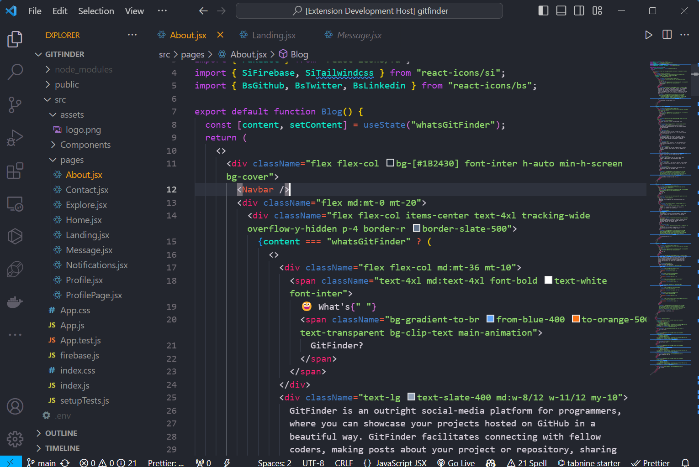
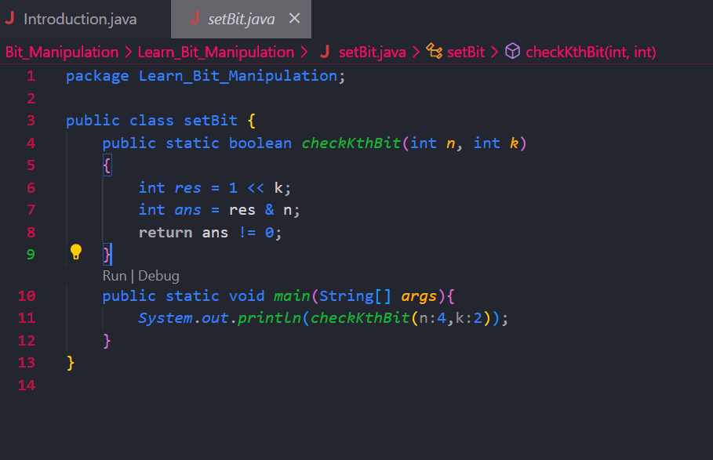

# ChromaBlend - VS Code Theme

ChromaBlend is a vibrant and dynamic Visual Studio Code theme that blends the colors of green, pink, and blue to create a unique coding experience. Dive into a visually appealing environment that balances aesthetics with readability.

## Features

- **Dynamic Color Blend:** Enjoy a harmonious mix of green, pink, and blue colors that adapt to create an engaging coding environment.

- **Readability:** The theme is designed to prioritize code readability, ensuring a comfortable and efficient coding experience.

- **Syntax Highlighting:** ChromaBlend provides syntax highlighting for a wide range of programming languages, making your code visually distinguishable.

## Screenshots

## Installation

- first Download [ChromaBlend]()
- Open Visual Studio Code.
- Go to View -> Command Palette... or use Ctrl + Shift + P.
- Type/select Color Theme.
- Choose ChromaBlend from the list
