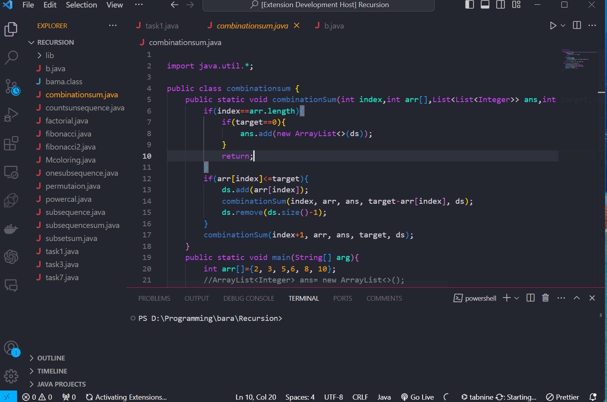

# ChromaBlend - Dynamic Dark & Light VS Code Theme

ChromaBlend is a vibrant and dynamic Visual Studio Code theme that offers a visually engaging environment by blending green, pink, and blue hues. Available in both dark and light modes, ChromaBlend is designed to balance aesthetics with readability, making your coding experience both comfortable and efficient.

## Features

- **Dynamic Color Blend:** A unique mix of green, pink, and blue colors creates an immersive and visually striking coding environment.

- **Dark & Light Modes:** Switch between dark and light themes to match your coding environment preferences.

- **Optimized Readability:** Thoughtfully designed to maintain high readability across various programming languages and text editors.

- **Syntax Highlighting** Enhanced syntax highlighting that supports a wide range of programming languages, improving code visibility and structure.

## Why Choose ChromaBlend?

ChromaBlend is more than just a theme—it's an experience. Whether you’re working late into the night or coding in the bright daylight, ChromaBlend adjusts to provide the perfect balance of color and contrast, reducing eye strain and increasing focus.
## Screenshots

## Installation

- first Download [ChromaBlend]()
- Open Visual Studio Code.
- Go to View -> Command Palette... or use Ctrl + Shift + P.
- Type/select Color Theme.
- Choose ChromaBlend from the list

## Contribute
If you have suggestions or want to contribute to ChromaBlend, feel free to [open an issue](https://github.com/BamaCharanChhandogi/ChromaBlend) or submit a pull request.
